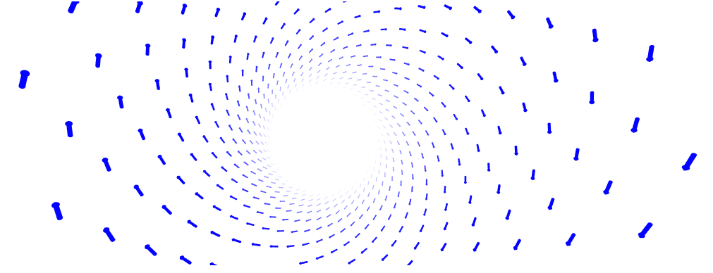

</img>
# NGL vector representation
A vector representation for nglviewer in Python.

Adds arrows for a list of positions and directions to an NGLViewer object.

#### To know how it works, just look at the example
